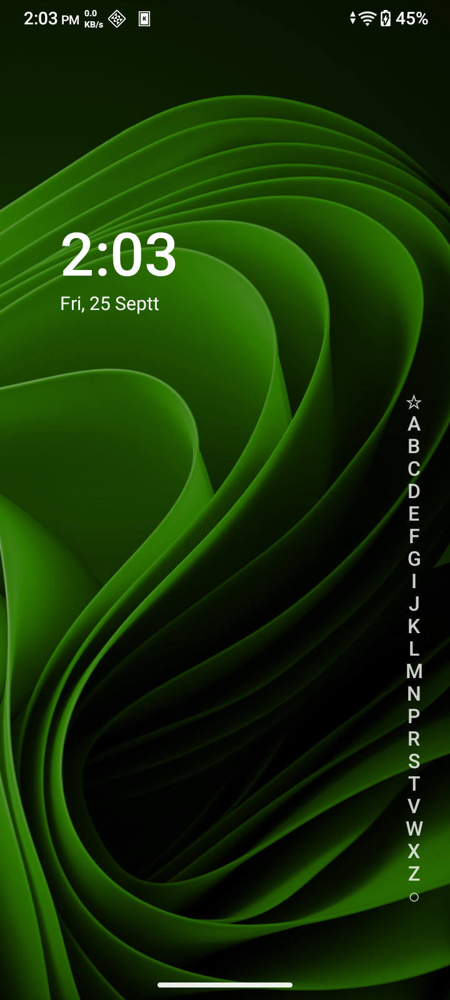

# Still Launcher (Android UI Launcher Lite)

A compact, ultra-lightweight Android home launcher inspired by Niagara's single-list layout. It is an independent native implementation built with zero third-party UI dependencies.

<p align="center">
  
</p>

## Highlights & Specifications

| Property | Details |
| :--- | :--- |
| **Platform** | Android 8.0+ (API 26+) |
| **Target SDK** | Android 16 (API 36) |
| **Language** | Native Java 17 |
| **Memory Footprint** | ~86 MB PSS, 0% CPU at idle |
| **License** | [MIT License](LICENSE) |

## Current features

- Default Home app request (Android 10+) and Home settings fallback on older Android versions.
- Installed app list, alphabet rail, app search, and app launching, including profiles visible to the launcher.
- Empty starter favorites to match the connected Niagara setup. Long-press an app in the list to add, remove, reorder, or open Android app info.
- Wallpaper-backed home screen with a clock and date, optional dimming, adjustable vertical position, and a left-side alphabet option.
- Package change updates. App catalog work runs off the UI thread, app-list icons load on demand, and the clock uses Android's minute broadcast only while the Home activity is visible.

Long-press the clock or date for settings. Tap the alphabet to open all apps, the bottom circle to search, or the top star to return Home. Press Back to return to Home.

## Build and install

### Windows (PowerShell)

```powershell
$env:JAVA_HOME = 'C:\Program Files\Android\Android Studio\jbr'
$env:ANDROID_HOME = "$env:LOCALAPPDATA\Android\Sdk"
.\gradlew.bat :app:assembleDebug
adb install -r .\app\build\outputs\apk\debug\app-debug.apk
```

### Linux / macOS

```bash
./gradlew :app:assembleDebug
adb install -r ./app/build/outputs/apk/debug/app-debug.apk
```

The debug APK will be generated at `app/build/outputs/apk/debug/app-debug.apk`.

## Google Play release

The app targets Android 16 (API 36) and builds a minified Android App Bundle. Before the first upload, decide whether to keep the application ID `com.aditya.stilllauncher`: Google Play treats it as the permanent identity of this app. Increase `versionCode` for every update.

Create and back up an upload keystore using Android Studio's **Build > Generate Signed App Bundle / APK**, or use your existing upload key. Keep the keystore and passwords outside this project. The Gradle release build uses these environment variables when all four are set:

| Variable | Meaning |
| --- | --- |
| `STILL_RELEASE_STORE_FILE` | Absolute path to the upload keystore |
| `STILL_RELEASE_STORE_PASSWORD` | Keystore password |
| `STILL_RELEASE_KEY_ALIAS` | Upload key alias |
| `STILL_RELEASE_KEY_PASSWORD` | Upload key password |

Then run `./gradlew.bat :app:lintRelease :app:bundleRelease` (or `./gradlew ...` on Linux/macOS). The bundle is generated at `app/build/outputs/bundle/release/app-release.aab`. A build without all four variables is **unsigned and cannot be uploaded**. Verify the signed bundle before uploading with `jarsigner -verify -verbose -certs app/build/outputs/bundle/release/app-release.aab`. Enroll in Play App Signing in Play Console.

The code alone cannot finish the Play listing. In Play Console, provide a hosted privacy policy (a draft is in [PRIVACY.md](PRIVACY.md)), accurate Data safety answers, store text and graphics, content rating, support contact, and testing/review information. The app currently reads installed launchable apps and stores favorites, the last few apps opened from the launcher, and display preferences locally. Review this behavior against the final release build when filling in Data safety. New personal developer accounts may need a closed test before production access.

## Device check (25 September 2026)

Installed and tested on a connected HMD Vibe2 5G running Android 16 at 720 × 1600, density 320. Default Home selection, alphabet browsing, search, Camera launch, return to Home, favorite add/remove, and Back navigation worked. No launcher crash appeared in the test logs. A warm alphabet scrub recorded 0 janky frames out of 27 rendered frames; process memory was about 86 MB PSS after browsing, and a later idle sample showed 0% CPU with no active services. These are short device samples, not a long-term battery measurement. Niagara was restored as the phone's default Home app after testing; Still Launcher remains installed.

Also tested on a Samsung SM-S711B running Android 16 at 1080 × 2340, with density overridden to 420. Verified installation and launch, installed app browsing, search filtering, Camera launch, app info, favorite add/remove/reorder/reset, Back, content position, alphabet side, wallpaper dimming, Home role selection, and return to Home from another app. Device testing exposed a clock shortcut that assumed Google's clock app and a duplicated letter in the September date; both were fixed. The updated build opened Samsung Clock and Calendar. Samsung's launcher was restored as default, and test favorites and display preferences were reset. The final release build and lint passed; this is a smoke test rather than exhaustive device or long-term battery coverage.

## Visual reference and limits

The layout was tuned against the connected phone's [Niagara reference screenshot](niagara-reference.png). Weather, calendar events, notifications, widget hosting, icon packs, and app pop-ups are not implemented yet. Those features require additional Android integrations and, in some cases, explicit user access.

See [NIAGARA_LAUNCHER_RESEARCH.md](NIAGARA_LAUNCHER_RESEARCH.md) for the research and implementation plan.

## License

This project is licensed under the terms of the [MIT License](LICENSE).
